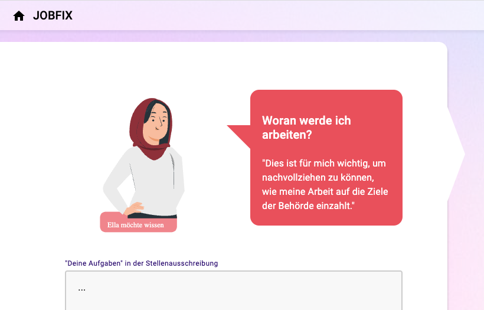
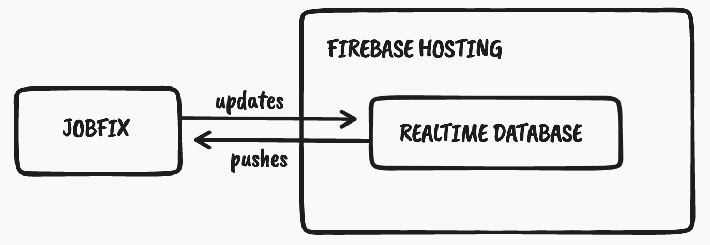

# Tech4Germany 2022 / ITZBund BMI

Jobfix ist ein Prototyp, um die Ergebnisse des dreimonatigen Tech4Germany Fellowships im Team ITZBund / BMI mit Nutzenden aus der Personalgewinnung zu vertesten.

Jobfix erlaubt die erstellung von modernen Stellenanzeigen, die zugeschnitten auf die Bedürfnisse von Bewerbenden. Verantwortliche aus Personalgewinnung und Fachabteilungen werden Schritt für Schritt durch verschiedene Themenblöcke der Stellenausschreibungen geführt. Die Stimme der Bewerbenden gibt dabei jeweils Hilfestellungen.




## Architekturskizze

Das Projekt wurde mit [Angular CLI](https://github.com/angular/angular-cli) Version 14.2.3 erstellt. Als backend und hosting Platform nutzt das Projekt Google [Firebase](https://firebase.google.com/).

### Deploy to Firebase 

Um Firebase zu konfigurieren die [CLI](https://firebase.google.com/docs/cli) herunterladen und mit dem Google Account verbinden

```
firebase login
```

Dann die App builden via

```
ng build
```

und schließlich auf Firebase hosting hochladen

```
firebase deploy
```

Das Projekt nutzt die Realtime Database von Firebase, um alle Frontend Instanzen synchron zu halten. Änderung, die ein Client verursacht, werden von der Realtime Database automatisch über eine Websocket Verbindung and alle anderen Clients gepushed.



## What's next?

Das vorliegende Projekt dient als Test Prototype. Eine direkte Umsetzung ist deswegen weder vorgesehen noch sinnvoll. Vielmehr soll anhand des aktuellen Prototypen ein tiefergehendes Produktverständnis erzeugt werden, sodass die Erkenntnisse aus den Tests eine konsequent nutzerzentrierte Weiterentwicklung ermöglichen.
